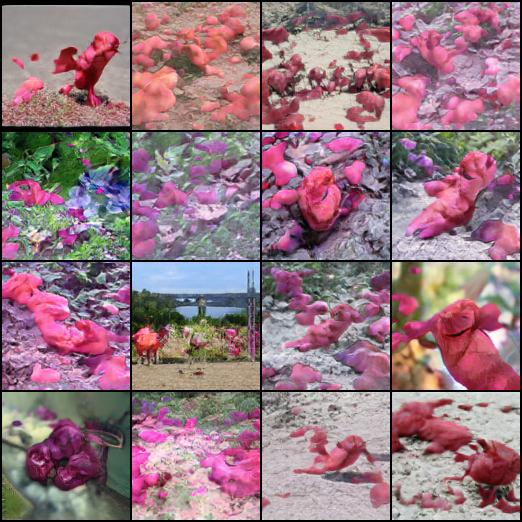
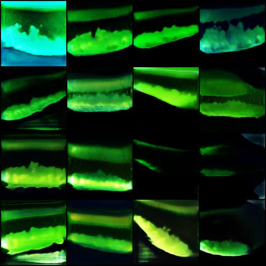
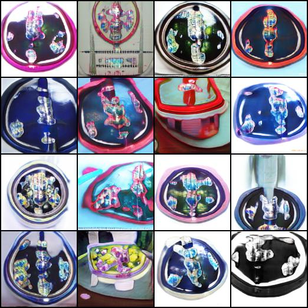

# Tetration - Classifier Training Pipeline

This repository provides a seamless pipeline for training a classifier on a given dataset by expanding the number of classes. It enhances pattern recognition by augmenting the dataset with CIFAR images. Additionally, the classifier serves as a discriminator for fine-tuning embeddings within a class-conditional neural network, fully integrated with the BigGAN-AM pipeline.

## Sample Images

Below are some examples of images generated from fine-tuning a class embedding using discriminator trained by this pipeline: 

- **Generated image of Rose**  
  

- **Generated image of Worm**  
  

- **Roses after hyperparameter tuning - Failed**  
  

## Usage

### Example Dataset
For example, you can use the [Flower Dataset](https://www.kaggle.com/datasets/alxmamaev/flowers-recognition).

### File Structure
Configure the following file structure:

```plaintext
Tetration/
│
├── dataset/
│   ├── [Image files]
│
└── first_demo_main/
    ├── [Loader scripts/files]
